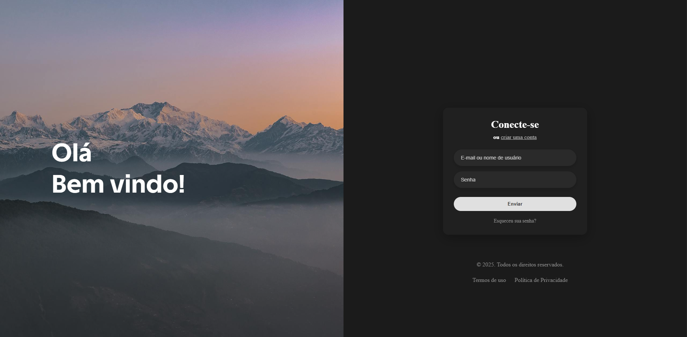

# 🔮 Página de Login com Efeito Glassmorphism

Um projeto de landing page com um formulário de login moderno, apresentando um layout split-screen, efeito de "vidro fosco" (glassmorphism) e um cursor customizado e animado.

## 🖼️ Preview

## ✨ Funcionalidades

* 🖥️ **Layout Split-Screen:** Design dividido que se adapta para uma única coluna em dispositivos móveis.
* 💎 **Efeito Glassmorphism:** O card do formulário utiliza `backdrop-filter` para criar um efeito de vidro fosco translúcido.
* 🖱️ **Cursor Customizado:** Um círculo (`.bola`) segue o ponteiro do mouse com uma animação suave (lerp) criada com JavaScript puro.
* 📱 **Design Responsivo:** Totalmente funcional em desktops e dispositivos móveis (o layout é empilhado verticalmente abaixo de 768px).
* ✨ **Micro-interações:** Efeitos de `hover` e `focus` suaves em botões e campos de input para uma melhor experiência do usuário.

## 🛠️ Tecnologias Utilizadas

* **HTML5** - Estrutura semântica da página.
* **CSS3** - Estilização, layout com Flexbox, `backdrop-filter` e Media Queries.
* **JavaScript (Vanilla)** - Manipulação do DOM e animação do cursor com `requestAnimationFrame`.

## 📁 Estrutura do Projeto

projeto-login-glass/
│
├── assets/
│   └── Mountain.jpg   # Imagem de fundo da "figure"
│
├── css/
│   └── style.css      # Folha de estilos principal
│
├── index.html         # Arquivo HTML principal
├── script.js          # Lógica do cursor animado
└── README.md          # Documentação do projeto

🚀 Como Usar
Clone este repositório:

Bash

git clone git clone [https://github.com/joaolucasbatista/Formulario-Login.git](https://github.com/joaolucasbatista/Formulario-Login.git)
Navegue até a pasta do projeto:

Bash

cd projeto-login-glass
Abra o arquivo index.html no seu navegador de preferência.

Projeto desenvolvido por: João Lucas
